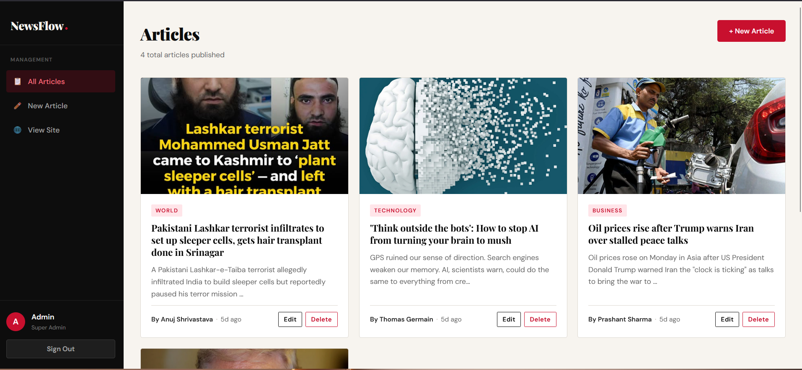

<div align="center">

# 📰 NewsFlow

**A modern news feed platform with role-based access, built for seamless reading and effortless content management.**


</div>

---

## 📌 Overview

**NewsFlow** is a full-stack news feed web application that delivers a clean, BBC-inspired reading experience. It features a dual-role system — **Admins** manage the entire news lifecycle while **Users** enjoy a distraction-free reading interface with powerful filtering, search, and pagination capabilities.

---

## ✨ Features

### 👤 User
- Browse and read published news articles
- Search news by keyword
- Filter articles by category or topic
- Navigate articles with smooth pagination

### 🛠️ Admin
- Add new news articles with image uploads (via Cloudinary)
- Edit and update existing articles
- Delete articles
- View and manage all published content
- Full dashboard control over the news feed

---

## 🖥️ Tech Stack

| Layer | Technology |
|---|---|
| Frontend | React.js |
| Backend | Node.js + Express.js |
| Database | MongoDB (Mongoose ODM) |
| Media Storage | Cloudinary |
| Authentication | JWT (Role-based: Admin / User) |

---

## 📂 Project Structure

```
NewsFlow/
├── client/                  # React frontend
│   ├── public/
│   └── src/
│       ├── components/      # Reusable UI components
│       ├── pages/           # Route-level pages (Home, Article, Admin Dashboard)
│       ├── context/         # Auth & global state
│       └── utils/           # API helpers, constants
│
├── server/                  # Node/Express backend
│   ├── controllers/         # Route handlers
│   ├── models/              # Mongoose schemas (User, News)
│   ├── routes/              # API routes
│   ├── middleware/          # Auth, role guards
│   └── config/              # DB & Cloudinary config
│
└── README.md
```

---

## ⚙️ Getting Started

### Prerequisites

- Node.js >= 18.x
- MongoDB (local or Atlas)
- Cloudinary account

### 1. Clone the Repository

```bash
git clone https://github.com/your-username/newsflow.git
cd newsflow
```

### 2. Configure Environment Variables

Create a `.env` file in the `server/` directory:

```env
PORT=5000
MONGO_URI=your_mongodb_connection_string
JWT_SECRET=your_jwt_secret_key
CLOUDINARY_CLOUD_NAME=your_cloud_name
CLOUDINARY_API_KEY=your_api_key
CLOUDINARY_API_SECRET=your_api_secret
```

Create a `.env` file in the `client/` directory:

```env
REACT_APP_API_URL=http://localhost:5000/api
```

### 3. Install Dependencies

```bash
# Install backend dependencies
cd server
npm install

# Install frontend dependencies
cd ../client
npm install
```

### 4. Run the Application

```bash
# Start the backend server
cd server
npm run dev

# Start the frontend (in a new terminal)
cd client
npm start
```

The app will be available at `http://localhost:3000`

---

## 🔌 API Endpoints

### Auth
| Method | Endpoint | Description |
|---|---|---|
| POST | `/api/auth/register` | Register a new user |
| POST | `/api/auth/login` | Login and receive JWT |

### News
| Method | Endpoint | Access | Description |
|---|---|---|---|
| GET | `/api/news` | Public | Get all news (with search, filter, pagination) |
| GET | `/api/news/:id` | Public | Get a single article |
| POST | `/api/news` | Admin | Create a new article |
| PUT | `/api/news/:id` | Admin | Update an article |
| DELETE | `/api/news/:id` | Admin | Delete an article |

---

## 🔍 Search, Filter & Pagination

Query parameters supported on `GET /api/news`:

```
/api/news?search=election&category=politics&page=2&limit=10
```

| Param | Description |
|---|---|
| `search` | Keyword search on title and content |
| `category` | Filter by news category |
| `page` | Page number (default: 1) |
| `limit` | Articles per page (default: 10) |

---

## 🎨 UI Design

The NewsFlow interface is inspired by the clean, editorial aesthetic of BBC News — featuring a structured news grid layout, clear typography hierarchy, and a category-based navigation bar. The design is original and not affiliated with or copied from BBC.

---

## 📸 Screenshots

> _Add your screenshots here_

| Home Page | Article View | Admin Dashboard |
|---|---|---|
|  |  |  |

---

## 🚀 Deployment

- **Frontend:** [Vercel](https://vercel.com) / [Netlify](https://netlify.com)
- **Backend:** [Render](https://render.com) / [Railway](https://railway.app)
- **Database:** [MongoDB Atlas](https://www.mongodb.com/cloud/atlas)
- **Media:** [Cloudinary](https://cloudinary.com)

---

## 🤝 Contributing

Contributions are welcome! Please follow these steps:

1. Fork the repository
2. Create a new branch: `git checkout -b feature/your-feature-name`
3. Commit your changes: `git commit -m 'Add some feature'`
4. Push to the branch: `git push origin feature/your-feature-name`
5. Open a Pull Request

---

## 📄 License

This project is licensed under the [MIT License](LICENSE).

---

<div align="center">
  Made with ❤️ by <a href="https://github.com/your-username">your-username</a>
</div>
